<!-- ── STATUS BAR ─────────────────────────────────────────────── -->

[ SYSTEM.ONLINE ]&nbsp;·&nbsp;MEM 82%&nbsp;·&nbsp;UPTIME ∞&nbsp;·&nbsp;08.2026

<!-- ── BANNER ─────────────────────────────────────────────────── -->

<!-- ── AVATAR ─────────────────────────────────────────────────── -->

EZRA_5566

SYSTEMS ENGINEER · CREATIVE DEVELOPER · *NIX ENTHUSIAST

  
  

<!-- ── TERMINAL ───────────────────────────────────────────────── -->

<!-- ── 01 · SYSTEM_PROFILE ────────────────────────────────────── -->

  
// [ 01 ] SYSTEM_PROFILE

  <table style="width:100%; border-collapse:collapse; font-size:12px; line-height:2;">
    <tr>
      <td style="width:150px; color:#6d7388; vertical-align:top;">&gt; handle</td>
      <td style="color:#e4e6ef;">ezra_5566</td>
    </tr>
    <tr>
      <td style="color:#6d7388; vertical-align:top;">&gt; role</td>
      <td style="color:#e4e6ef;">systems engineer / creative developer</td>
    </tr>
    <tr>
      <td style="color:#6d7388; vertical-align:top;">&gt; focus</td>
      <td style="color:#e4e6ef;">web · automation · 3D · open source</td>
    </tr>
    <tr>
      <td style="color:#6d7388; vertical-align:top;">&gt; status</td>
      <td style="color:#e4e6ef;">building &amp; breaking things on linux — ask me about nvim &amp; python</td>
    </tr>
  </table>

<!-- ── 02 · SKILL_MATRIX ──────────────────────────────────────── -->

  
// [ 02 ] SKILL_MATRIX

  <table style="width:100%; border-collapse:collapse;">
    <tr>
      <td style="width:50%; vertical-align:top; padding:0 6px 12px 0;">
        

          
[01] LANGUAGES

          
the dialects — automation, scripting &amp; the glue between systems

          
          
          
          
          
          
        

      </td>
      <td style="width:50%; vertical-align:top; padding:0 0 12px 6px;">
        

          
[02] FRONTEND

          
the interface — pixels, motion &amp; interactive 3D in the browser

          
          
          
          
          
        

      </td>
    </tr>
    <tr>
      <td style="width:50%; vertical-align:top; padding:0 6px 0 0;">
        

          
[03] BACKEND &amp; SYSTEMS

          
the machine room — serving, storing &amp; self-hosting on *nix

          
          
          
          
          
        

      </td>
      <td style="width:50%; vertical-align:top; padding:0 0 0 6px;">
        

          
[04] TOOLING &amp; CREATIVE

          
the workbench — editors, git, pixels &amp; geometry

          
          
          
          
          
          
          
        

      </td>
    </tr>
  </table>

<!-- ── 03 · TELEMETRY ─────────────────────────────────────────── -->

  
// [ 03 ] TELEMETRY

  <table style="width:100%; border-collapse:collapse;">
    <tr>
      <td style="vertical-align:middle; padding:4px; text-align:center;">
        
      </td>
      <td style="vertical-align:middle; padding:4px; text-align:center;">
        
      </td>
    </tr>
  </table>
  

    
  

<!-- ── 04 · CONTRIBUTION_MATRIX ───────────────────────────────── -->

  
// [ 04 ] CONTRIBUTION_MATRIX

  

    
  

<!-- ── EXTENDED LOG ───────────────────────────────────────────── -->

  
&gt; EXTENDED_LOG

  

    🔭 currently: deploying cyber-adjacent things, web builds &amp; self-hosted chaos 
    🌱 learning: everything that compiles 
    👯 open to: collabs on web experiments &amp; open source 
    💬 ping me about: nvim · python · linux · pixel engineering 
    ⚡ fun fact: permanently addicted to linux
  

<!-- ── FOOTER ─────────────────────────────────────────────────── -->

  © 2026 EZRA_5566 · BUILT IN THE VOID · 0xA7F3 
  NO_TRACKERS · PURE_SIGNAL

